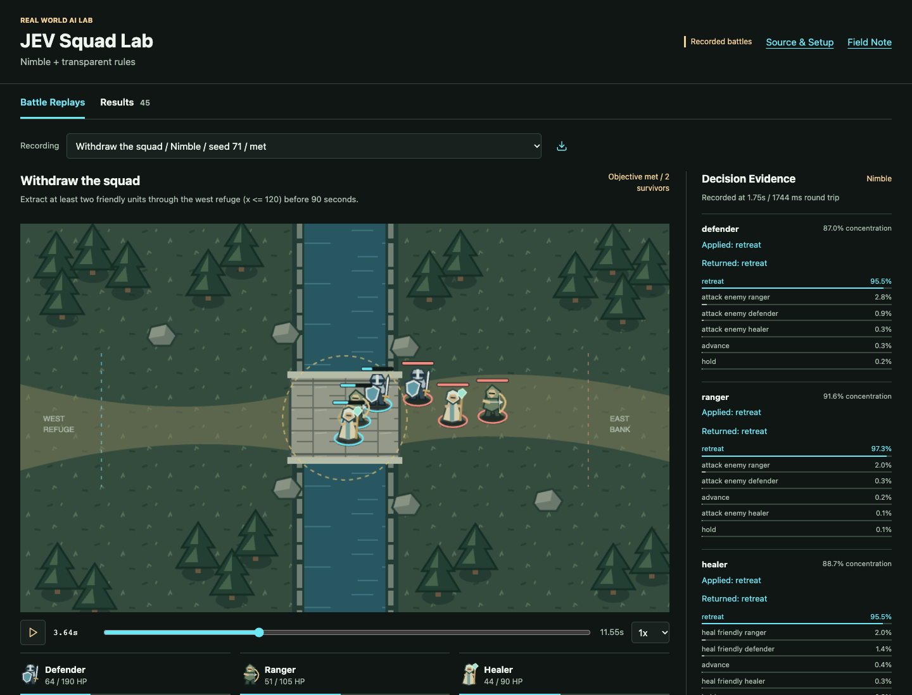
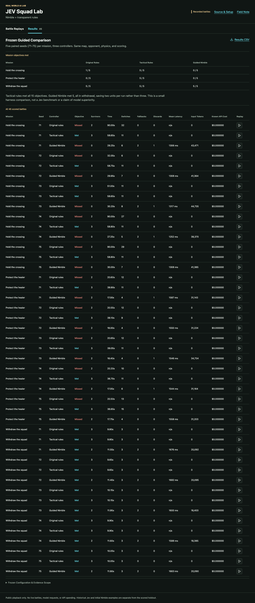
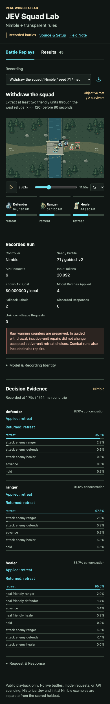

# JEV Squad Lab

A small tactical sandbox exploring a practical question: **when does a model
choosing among legal actions add value beyond ordinary game AI?**

- [Watch the interactive battle replays](https://disbitski.github.io/jev-squad-lab/)
- [Read the field note](https://github.com/disbitski/real-world-ai-lab/blob/main/field-notes/2026-10-01-warcraft-jev-nimble.md)
- [Inspect the complete scored results](replay/data/results.csv)
- [Inspect all reviewed recordings](replay/data/catalog.json)

The public site is **replay-only**. Selection, playback, pause, speed, and
scrubbing consume recorded snapshots and decision events. There are no live
battles, API-key fields, inference requests, proxy, or paid backend on Pages.
The live simulator source is available here for your own local experiments.

## What We Actually Found

The frozen guided comparison contains 45 completed battles: five fresh paired
seeds (71-75), three missions, three controllers, one unchanged scripted enemy.

| Mission | Original rules | Tactical rules | Guided Nimble |
| --- | --- | --- | --- |
| Hold the crossing | 1/5 | 5/5 | 0/5 |
| Protect the healer | 0/5 | 5/5 | 0/5 |
| Withdraw the squad | 5/5 | 5/5 | 5/5 |

Tactical rules saved all three units in every run. Guided Nimble saved two per
withdrawal run and lost the defender. The model has **not** demonstrated an
advantage over the explicit tactical policy.

The guided model series reported 158 requests, 465,858 input tokens, mean batch
round-trip latency of 1,439 ms and p95 of 1,757 ms. Local API charges were $0;
hardware and electricity were not costed. There were 136 applied Nimble
decision batches, 16 fallback labels, and six terminal-response discards.
The ten withdrawal warning batches concerned inactive actors; accepted active
orders stayed the model's returned retreat choices. Combat also had rules
repairs. No throttles, client timeouts, or unknown-usage requests occurred in
this scored series. Raw counters remain in every recording.

Three additional historical examples are **not pooled into the 45-run table**:
initial original-rules withdrawal, initial unguided Nimble withdrawal, and a
hosted Jev partial-access hybrid. The first local model series missed all five
withdrawal objectives. Briefing, encoding, and integration changed together
before the guided series on different seeds; this is not a prompt-only causal
test, weight training, or autonomous learning of tactics.

Hosted Jev applied one genuine batch in each of ten scheduled exploratory
battles before fallback. Across those trials there were 53 HTTP 429 responses
and three client-deadline timeouts in 66 attempts. Known usage-based charges
were about $0.000955; 56 attempts had unknown usage, so total actual cost is
unknown. The exported hosted recording is one example, not all ten trials.
Gateway versus upstream limiting remained unresolved. These hybrid runs are
not a Jev tactical benchmark or proof of deliberate access misrepresentation.

## Replay Viewer

The battlefield renders the saved positions, health, extracted/fallen units,
actions, and recent combat events. Decision evidence shows returned choices,
probabilities, confidence, applied orders, fallback warnings, and latency.
Confidence describes probability concentration, **not correctness** or a
reasoning explanation. No explanation is invented for a choice.

The default recording is guided Nimble withdrawal, seed 71. Compare it with
tactical rules on the same seed, then watch a failed crossing mission.
The Results tab links every scored row to its own replay. Historical examples
are separately labeled in the recording menu.







Playback requires an initial download of the static site and selected recording.
Once loaded, play/pause/scrub work offline. Recordings not yet loaded require a
connection. Only relative, same-origin static assets are used; there are no CDNs
or analytics. A self-only connection policy prevents provider calls.

## Local Setup

Node 24 or newer is required. The measured environment was Node v24.18.0,
Ollama 0.35.0, Nimble 9B Q8_0 on an M4 Max Mac with 48 GB RAM. Nimble is a
**different model from Bespoke Labs**, not local Jev.

```sh
npm ci --ignore-scripts
npm run replays:build
npm run replays:serve
```

Open `http://127.0.0.1:4214/` for the static viewer. This command does not
start the simulator or call a model.

For live experiments on your own machine, copy `.env.example` to `.env`, install
Ollama and its Nimble decision model, then run:

```sh
ollama pull nimble
npm run start:nimble
```

Open `http://127.0.0.1:4196/`. Starting the local Nimble service verifies and
warms the model; pressing Start runs real local decisions. The local app also
offers original and tactical rules, three missions, exploratory orders, and
recording. Local inference is not part of the public site.

The `jev` controller identifier is a legacy internal slot for the configured
decision provider; inspect `meta.provider` and `meta.model` to distinguish
Nimble from hosted Jev. Never mix providers within a scored series.

For optional hosted use, inspect `lib/provider.js` and the provider's official
current pricing first. Supply your own server-side credential in ignored
`.env`, explicitly select the provider/model, and confirm the price guard.
No cloud credentials are included here, and the example defaults to local-only
Ollama. Historical hosted prices are observations, not a current quote.

## Safety And Reproducibility

- Live servers bind to loopback and reject remote origins and redirects.
- Credentials stay server-side in ignored `.env`. No desktop/account/editor control.
- Code owns physics, arithmetic, cooldowns, legal actions, and scoring.
- One request in flight, at least one second between starts, two-second deadline.
- Revalidate actions; reject old runs, dead targets, pause/reset races, and stale responses.
- Hosted budget guards retain a $5 ceiling and a 1,500-request cap with a persistent ledger. Unknown usage is conservatively reserved, not reported as an invoice.
- Original recordings are private. Public derivatives omit free-text orders, account ledgers, raw headers, and provider routing metadata. `sourceChecksum` identifies the original; `checksum` verifies the public payload.
- Core frozen file hashes and the lockfile match the guided run. Exact runtime timing can still vary. The initial/hybrid examples used earlier code configurations recorded in their metadata.
- `nimble:latest` and `typesafe-ai/jev` are aliases, not immutable version pins. The local observed digest is recorded; a numbered Jev version was not returned.

The observed local digest is
`24e550a16a7081881be2f1f0d91e8cc13a597472735c04119f035a0a85c67e0c`.
The guided configuration hash is
`730449eaef2f2e95379c56f0eb31c052bb2dc6e4f139b03a43cecd73a19f4a99`.

## Verify Or Rebuild

```sh
npm run check
npm run replays:build
npm run replays:test
```

Unit tests use mock transports, not paid inference. The separate replay browser
suite serves only `docs/`, checks desktop/mobile canvas pixels and controls,
offline playback, and absence of inference requests. The original `test:ui`
suite targets a separately running live simulator; do not use it as a replay
test or against someone else's active battle.

`replay/` contains the viewer source and reviewed data; `docs/` is its explicit
static build for GitHub Pages. `lib/`, `server.js`, `public/`, and the original
experiment scripts comprise the local live application and are never copied
into Pages. To re-export this exact archived series from private originals:

```sh
npm run replays:export -- /path/to/original/experiment
npm run replays:build
```

Exporting verifies original checksums and requires completed recordings. It
does not run inference. Review the resulting artifacts before publishing;
future experiments need a separately reviewed export scope.

## Credits And Scope

Original fantasy art is CC0; see [asset credits](public/assets/LICENSE.md).
Phaser and Matter.js are MIT; Lucide is ISC. Vendored Phaser/Lucide licenses
are included in `docs/vendor/`. Application code is MIT.

[wc3env](https://github.com/pwang724/wc3env) was independent inspiration, not
our implementation or an official TypeSafe Warcraft demonstration. No Warcraft
assets, automation, economy, or retro-machine integration are included.

Official references: [TypeSafe Jev](https://typesafe.ai/blog/introducing-system-one-models-and-jev),
[Vercel integration](https://vercel.com/i/jev-integrations),
[Ollama Nimble](https://ollama.com/library/nimble), and
[Bespoke Labs Nimble](https://github.com/bespokelabsai/nimble).
